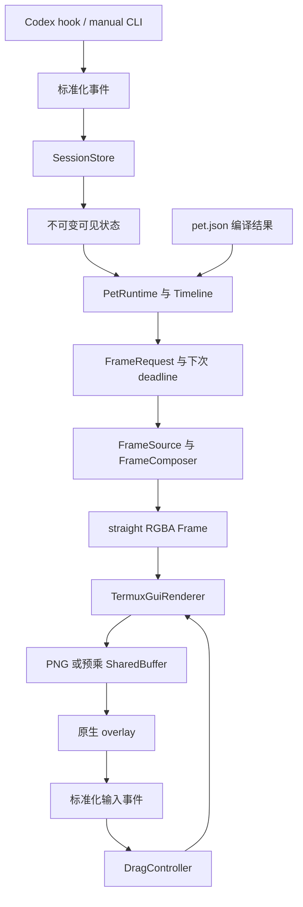

# Termux 桌宠技术栈与重构实施方案

日期：2026-10-02。代码基线：`ca2bc4d5859713626e2c8a345bcecd8b3ca57d84`。这是针对现有仓库和当前 Android 设备完成依赖、协议、图片、播放模型与人工显示验证之后的实施方案；本次交付包含实验工具和记录，没有把重构原型部署为生产版本。

推荐继续使用 **Python、Termux:GUI 原生 overlay、一个 daemon、一个 GUI worker、按截止时间唤醒的事件循环**。图片准备统一到 **Pillow、不可变连续 bytes、有字节预算的缓存**。先保留 PNG 帧目录，增加 JSON manifest；共享 buffer 用作大画布的传输优化，PNG 保留为小画布路径和故障回退。WebP atlas 是可选的素材容器，NumPy 不进入运行时必需依赖。

优先级是：修复连接与唤醒的阻塞风险，分离业务选图和原生绘制，迁移动画数据与时间线，再切换 codec 和共享传输。不能先替换 `setimage()` 就认为重构完成。

## 实测范围与证据

实验环境为 ALN-AL10、Android 12 / API 31、Python 3.14.6、`termuxgui 0.1.6`、插件 `getVersion=7`、libpng 1.6.59。实验 View 的 64 dp 实测为 208 屏幕像素，密度为 3.25；不能沿用默认 3.0 做所有设备的坐标计算。

Pillow 12.3.0 和 NumPy 2.4.4 通过实际下载 Termux 包、解包到私有缓存、配置子进程的库路径后运行。Pillow/WebP/NumPy 原生扩展确实执行过，不是只看包名。全局环境和安装中的桌宠没有改动。依赖安装模拟、包版本、哈希和首次缺库错误保存在实验记录中。

完整复现入口见 [实验说明](../experiments/2026-10-renderer/README.md)；原始结果分为 [图片](../experiments/2026-10-renderer/image-results.json)、[GUI](../experiments/2026-10-renderer/gui-results.json)、[时间线和唤醒](../experiments/2026-10-renderer/runtime-results.json)、[人工对照](../experiments/2026-10-renderer/visual-results.json)、[buffer 生命周期](../experiments/2026-10-renderer/buffer-lifecycle.json)；版本和上游源码依据见 [源码核对](../experiments/2026-10-renderer/source-findings.md)。

| 项目 | 实际验证方式 | 结果与适用范围 |
| --- | --- | --- |
| 现有行为基线 | 全套 unittest | 改动前 147 项通过；实验工具的 EOF 回归另有测试 |
| overlay 与 PNG | 独立连接创建窗口，提交三种尺寸的图像 | 本机可用；未更改生产会话和位置 |
| buffer 格式 | 分别真实创建 `ARGB888`、`ARGB8888` | JSON 协议只接受前者；后者触发 binding 的错误处理缺陷 |
| 共享像素传输 | 写入预乘 bytes、blit、refresh、同连接 getVersion 屏障 | 本机可用；证明数据已消费，不证明屏幕已呈现 |
| 半透明正确性 | 全部 65,536 个颜色值与 alpha 组合；PNG 与原始 buffer 双图人工比较 | Pillow 预乘与整数公式完全相同；用户确认两侧边缘一致 |
| 基础触摸 | 人工分别拖动双图窗口，记录 native 事件和 move 提交 | 用户确认两侧拖动正常；不代替生产版边缘锚点和取消手势验收 |
| buffer 释放与重连 | 删除旧 buffer / 最近分配 buffer 后查询，再重新连接 | 前者成功；后者连接关闭；连接生命周期持有 buffer 的路径可用 |
| binding EOF | socketpair 关闭、50 ms socket timeout、外部 watchdog | 原版读取仍空转；探针 EOFGuard 能立即退出 |
| PNG 解码 | 34 张生产物理帧分别用 libpng、Pillow 解码 | RGBA 逐字节一致 |
| WebP atlas | 实际生成、裁切、解码并比较所有像素 | `lossless=True, exact=True` 完全一致；只写 lossless 会改变全透明像素的隐藏 RGB |
| NumPy view | 从 atlas 切出非连续视图并写 mmap | 直接写入失败，需连续化；视图还会保留整张 atlas |
| manifest 表达力 | 两宠物、全部状态来源组合、三个循环数、六种徽标数 | 1080 条路径、8694 次曝光的 PNG 哈希和时长一致 |
| 长时间挂起 | 现有 timeline 与整数循环原型比较 | 确认现有逐帧追赶成本；原型仅证明 Running 循环算法 |
| 唤醒背压 | 独立 socketpair 填满，再调用现有 wake | 确认阻塞；非阻塞通知方案立即返回 |
| 启动锁等待 | 临时锁文件由另一进程持有，隔离调用 start_daemon | `wait=0.05` 仍超过 0.3 秒；当前超时未覆盖获取锁 |

本次未测量 Android GUI 进程 CPU、实际呈现时间、功耗、温度或跨 ROM 兼容性。adb 二进制存在动态链接错误，dumpsys 缺权限，screencap 没有产出像素，因此采用真实窗口加人工对照；不声称完成自动屏幕像素回读。锁屏、转屏、多指取消、长时间后台和升级 APK 的测试仍是后续阶段验收项。

## 技术栈决策

| 层 | 最终选择 | 迁移和版本约束 |
| --- | --- | --- |
| 运行与数据模型 | Termux Python 标准库，dataclasses、json、socket、select、time | 本机验证 Python 3.14.6；不另加 asyncio、Web 服务或第二 daemon |
| 窗口与输入 | Termux:GUI overlay 和 Python binding | 本机验证 binding 0.1.6 + APK versionCode 7；APK 升级需重跑协议探针 |
| 协议兼容 | 项目内部的有限读取、FD 管理和 overlay 适配代码 | 隔离 binding 私有字段与版本差异；不修改用户 site-packages |
| 图片 codec | Pillow | Termux 的 `python-pillow` 包；真正替换前验证合成帧和两种宠物的像素等价 |
| 素材格式 | JSON manifest + 现有独立 PNG | 不改变 256×256 Akita、64×64 Robot 或当前 64 dp 显示尺寸 |
| 帧数据 | 连续、只读、straight RGBA bytes，明确宽高和 sRGB | Android 预乘格式只存在于 transport 准备缓存中 |
| Android 图片提交 | PNG transport 与 shared-buffer transport | 两者属于同一 renderer 的内部策略，不是两个业务后端 |
| 调度 | 单调整数时钟 + 最近 deadline + select | 动画按逐帧曝光，移动只在需要时调度，事件可立即唤醒 |
| 缓存 | 按字节预算的 LRU，帧引用去重 | 只保存当前策略需要的编码，禁止多格式无限复制 |
| 测试 | unittest、独立原型探针、真实 overlay、人工交互验证 | 自动化与人工证据分开记录 |
| 可选素材容器 | 无损 WebP atlas | Pillow WebP feature 与像素往返通过后启用，不是 shared buffer 前置条件 |
| 离线可选工具 | NumPy | 不作为 hook、daemon 或普通 CLI 的依赖 |

继续保留当前 Termux:API 通知回退的可选地位。Python 程序不需要开发自己的 APK，但 Termux:GUI 插件 APK 仍须安装且有 overlay 权限。签名兼容由 Termux 安装契约决定，本次不迁移应用渠道。

不引入 GLES2、WebView、Rive、SDL、其他桌面后端、新的 Shell/Claude 适配器或自动行走功能。它们不参与推荐路径，因此不把“没有测试这些后端”包装成已解决的兼容性。

## 实测如何改变选择

### Pillow 足够完成运行时图片准备

下表是 256×256 当前帧的串行测试中位数；解码从内存中的编码 bytes 开始，包含输出 RGBA 的成本，未清空 OS 缓存。

| 操作 | 中位耗时 |
| --- | ---: |
| 当前 libpng 解码 | 1.237 ms |
| Pillow 解码并输出 RGBA bytes | 1.592 ms |
| Python 整数循环预乘 | 37.427 ms |
| Pillow `RGBA → RGBa → bytes` | 0.505 ms |
| 本次 NumPy uint16 公式及 bytes 输出 | 2.272 ms |
| bytes 复制到匿名 mmap | 0.00478 ms |

这些结果不说明 Pillow 解码更快；采用 Pillow 的收益是统一维护 codec、预乘、缩放和 WebP 支持，移除手写 ctypes ABI。NumPy 的这一种实现不占优势，且额外引入 NumPy / OpenBLAS。新进程实测 NumPy 导入增加约 13.3 MiB RSS，Pillow.Image 约 6.1 MiB；实际包安装也涉及额外 native 依赖。因此 NumPy 不进入运行路径。

预乘只做一次并缓存，不能把约 37 ms 的 Python 像素循环放进 40 ms 的曝光路径。RGBA 到预乘的规则是 `(channel * alpha + 127) // 255`，alpha 不变。Pillow `RGBa` 在所有颜色/alpha 组合上与该公式一致。

### Shared buffer 有收益，但必须修复生命周期

GUI 进行三轮对比，顺序交替；每轮每个路径 100 个非节流样本和 30 个 25 Hz 移动样本，另有 5 次预热。素材在计时前准备完毕，两条路径均等待同连接 `getVersion`。384×416 是把现有 256×256 图不缩放地放进透明大画布，仅验证接口和负载，不是新美术验收。

以下中位数为三轮中位数的中位数；P95 列是各轮 P95 的范围，不是合并样本 P95。

| 画布与工作负载 | PNG 中位数 | Shared 中位数 | PNG 各轮 P95 范围 | Shared 各轮 P95 范围 |
| --- | ---: | ---: | ---: | ---: |
| 64×64，不节流 | 1.04 ms | 0.94 ms | 2.25–3.99 ms | 1.78–3.70 ms |
| 64×64，25 Hz 并移动 | 4.11 ms | 3.84 ms | 6.03–8.70 ms | 4.68–7.02 ms |
| 256×256，不节流 | 5.99 ms | 1.19 ms | 8.11–16.06 ms | 2.89–7.10 ms |
| 256×256，25 Hz 并移动 | 18.37 ms | 4.26 ms | 22.40–25.33 ms | 6.74–11.56 ms |
| 384×416，不节流 | 6.38 ms | 0.98 ms | 8.93–10.28 ms | 2.81–4.21 ms |
| 384×416，25 Hz 并移动 | 19.26 ms | 4.71 ms | 22.52–26.09 ms | 7.47–9.00 ms |

该指标包含 PNG 解码/原生命令处理或 raw copy/刷新请求的已核对执行路径，并不等于 Android 合成器实际呈现。现有生产桌宠在实验期间保持运行；没有锁定 CPU 频率，不据此推导电量节省或承诺固定倍数加速。

据此，目标策略为：当前小尺寸 Robot 保留 PNG；当前 Akita 在兼容层和生命周期验收完成后使用 shared buffer，PNG 作为连接重建后的回退。策略由 renderer 根据部署能力和画布配置决定，不把 Termux 字段写进 Pet Pack，也不让 renderer 识别业务状态。其他尺寸在支持时重新验证，不把本机测量变成通用尺寸阈值。

### Atlas 是后续容器优化

34 张独立生产 PNG 合计 3,021,653 字节；同批帧打成 PNG atlas 为 2,205,697 字节，exact lossless WebP atlas 为 1,585,144 字节。后者约减少 47.5% 存储，但不减少解码后的帧内存，也不会增加姿势数量或改善步态。

当前 34 张 256×256 RGBA 是 8.5 MiB；80 张缓存是 20 MiB。换成 384×416 则分别约 20.72 MiB 和 48.75 MiB。再同时保留 atlas、裁切副本、Pillow 对象、NumPy 数组和预乘副本会叠加占用。实验还确认 NumPy 的 atlas crop 非连续，不能直接赋给 mmap。

优先保留 PNG 文件和审核指纹。未来 atlas loader 解码后输出同一 FrameSource 合同；应选择“保留 atlas 及有限帧缓存”或“切出所需帧后释放 atlas”，不同时无限持有两套。WebP 导出必须显式 `lossless=True, exact=True`，并对直通道 RGBA 做完整往返比对。

## 当前必须解决的五个实测问题

1. **binding EOF 空转。** `read_msg` 和 `read_msg_fd` 未检查空读；socket timeout 对已经 EOF 的 fd 无效。兼容层必须实现 `read_exact` 的总 deadline、EOF 检查、长度限制和 FD 校验。连接构造握手也在该保护范围，不能只包装连接完成后的 socket。实验工具的 EOFGuard 只是局部验证，不能直接当作完整生产兼容层。
2. **最近一次传出的 shared FD 被删除后连接失效。** 本机先创建 A/B，删除 A 后查询成功；删除 B 后查询收到 EOF。插件未清除发出的 ancillary FD 与 Android 12 的重复附带行为是吻合的源码解释，但没有 native 异常堆栈，不称为已完全证实的 ROM 内部根因。首版采取已验证的办法：一个连接持有一个 framebuffer，活跃期间不删除；退出或改变画布尺寸时关闭并重建整套连接。PNG 回退也先重建连接，不在未知消息状态上继续发请求。
3. **GUI wake 阻塞。** 独立 socketpair 填入 5462 个单字节通知后写满；现有调用在人工注入 10 ms timeout 时等待约 10.1 ms。实际默认没有这个 timeout。写端改 nonblocking，满时忽略重复通知，读端 drain；状态事件仍逐条 apply，只合并唤醒。停止消息和 reconnect 同样不得阻塞 IPC 线程。
4. **挂起恢复线性追赶。** 24 小时 Running 跳转，原实现三次中位约 1915 ms，整数循环原型约 0.016 ms。原型验证 300 个精确边界和 500 个非边界位置，仅覆盖 Running 循环。生产实现需扩展到 clip next/loop/hold，跳整圈后定位当前帧，不能仍逐个遍历所有逝去曝光。
5. **启动锁没有被启动超时覆盖。** 当前 `runtime.start_daemon(wait)` 先阻塞获取 START_LOCK，再开始计算 deadline。隔离实验持有临时锁，传入 `wait=0.05`，0.3 秒 watchdog 到期仍未返回。应从入口计算绝对截止时间，用非阻塞 flock 和剩余预算重试；超时返回失败，由 hook 保持 fail-open。不能只给 socket 请求设置超时。

## 目标模块和数据流



`gui.py` 继续作为唯一 GUI worker 和事件循环，协调上图；daemon 不调用 native API。Runtime 不导入 termuxgui、Pillow 或具体素材解码代码。FrameSource 不认识 session/turn/tool。Renderer 不接收业务 snapshot。

```text
codex_pet/
  adapters/codex.py       Codex 原始 JSON 到语义事件
  state.py               语义事件、SessionStore、优先级和轮次规则
  pet_runtime.py         可见状态到动作入口、FrameRequest
  animation.py           通用 Clip/Timeline 和离线 schedule
  pets.py                manifest 元数据、验证、编译、外观目录
  frames.py              PNG/内置 Robot source、装饰合成、字节预算缓存
  image_codec.py         Pillow 编解码、像素表示转换
  touch.py               纯 DragController
  renderer/protocol.py    Frame/输入/状态合同
  renderer/termux_gui.py  窗口、native 输入、图片提交、资源生命周期
  renderer/transport.py  有限协议读写、FD/overlay/binding 兼容
  gui.py                 GUI worker、select、wake、重连、状态发布
  daemon.py              单 daemon、会话、IPC、通知
  runtime.py             现有启动锁、路径、IPC client，保持原义
  assets/akita/pet.json   PNG 引用、clip、transition、装饰元数据
  assets/robot/pet.json   受控内置绘图引用
```

数据类放在其拥有模块，不为每个对象增加一层目录。`runtime.py` 现有职责是进程和 IPC，因此新增 `pet_runtime.py`，避免同名混淆。`hooks_config.py`、`preferences.py`、部署事务主体继续沿用。

## 具体文件怎么改

| 当前代码 | 改动 | 完成后应删除或禁止 |
| --- | --- | --- |
| `gui.py: OverlayUI.render(snapshot, frame)` | worker 调 PetRuntime 得到 FrameRequest，source/composer 产出 Frame，renderer 只做 `present(frame)` | renderer 中读取 state/count/appearance、导入 art/animation/state |
| `gui.py: handle()` | native 事件解包、坐标变换在 renderer；识别拖动在纯 DragController；worker 执行移动与保存 | 手势逻辑直接调用文件保存，依赖两个 down 事件的到达顺序 |
| `gui.py: GuiWorker.wake()` | nonblocking write，EAGAIN 合并通知，read drain | GUI 停顿时阻塞 hook/IPC 路径 |
| `runtime.py: start_daemon()` | 入口建立总 deadline，START_LOCK 非阻塞获取并使用剩余预算；启动和重试沿用同一预算 | 先无限等锁再开始计时 |
| `gui.py: _overlay/_measure_density` | 集中到 backend compatibility；连接超时、首次布局测量、重连清理显式化 | overlay getConfiguration 查询；每帧查询 native 尺寸 |
| `animation.py` 的 Akita/Robot 分派 | 时长、物理帧引用、next/loop/hold、transition 放入 manifest | AKITA 魔术下标、按外观 profile 分支的通用时间线 |
| `AnimationTimeline.advance()` | 累计整数时间，有限入口链，loop 用整周期算术跳过和 bisect | 对所有错过帧逐一追赶 |
| `AnimationTimeline.sync()` | PetRuntime 负责是否重启动画及选择 transition；timeline 只接受 clip 入口 | timeline 自己理解 Codex 状态优先级或 GUI |
| `art.py` | 拆成 source、composer、codec；暂留兼容 facade 迁移工具 | art 导入 animation；Pillow/libpng/PNG writer/状态徽标混合实现 |
| `art.py: _robot_icon()` | 内置白名单 Robot source，基础姿势和有限徽标变体缓存 | 每次重复完整绘制和 PNG 编码 |
| `art.py: _ready_blink_icon()` | 原像素导出为 derived frame，记录来源矩形和解码像素哈希 | 通用 runtime 硬编码秋田犬眼睛坐标 |
| `art.py: _add_count_badge()` | composer 消费 count 和 pack 装饰样式，保持当前两宠物不同样式 | renderer 读取 running_count 自行绘制业务徽标 |
| `pets.py: PetAppearance` | 轻量读取 manifest；分别保存 width/height、display width/height | `image_size_px` 对所有图片隐含正方形；三处 profile 分派 |
| `state.py: event_from_hook` | 移到 adapters/codex.py；store 根据语义 kind 保持关闭轮次规则 | store 分派具体 hook 名；事件简化为仅 `set_state` |
| `daemon.py: status()` | GUI worker 发布不可变 OverlayStatus；IPC 读快照 | IPC 线程直接读取 `gui.ui.x/y/...` 的可变 native owner 对象 |
| `deployment.py` | 切换 current 前验证 manifest、引用、尺寸、解码能力和依赖；资源留在已复制的 codex_pet 内 | 顶层新增 pets 后漏复制；无效资源仍激活 release |
| preview/audit/export 工具 | 使用统一 frame 与 schedule 接口；保留 Akita 专用爪点诊断 | 离线另写一套时长；导入 art 私有 ctypes codec |

## 接口合同

以下是目标合同，不是宣称已经实现的新公共 API。

```python
@dataclass(frozen=True)
class FrameRequest:
    pack_id: str
    frame_ref: str
    count: int

@dataclass(frozen=True)
class RgbaFrame:
    key: tuple                 # pack revision + frame + composition identity
    width: int
    height: int
    pixels: bytes              # len == width * height * 4, tightly packed
    # v1 固定 straight alpha、RGBA8、sRGB，不接收含糊的 ndarray。

class FrameSource(Protocol):
    def frame(self, reference: str) -> RgbaFrame: ...

class PetRuntime:
    def sync(self, visual: PetVisual, now_ns: int) -> None: ...
    def advance(self, now_ns: int) -> None: ...
    def current(self) -> FrameRequest: ...
    @property
    def deadline_ns(self) -> int | None: ...

class Renderer(Protocol):
    def present(self, frame: RgbaFrame) -> None: ...
    def move(self, x_screen_px: int, y_screen_px: int) -> None: ...
    def close(self) -> None: ...
```

`present()` 的 contract 必须同时写明：相同 key 不重复提交；输入不可变；返回意味着提交成功且 shared staging 已被消费，不保证屏幕呈现；失败不更新 last_key；异常后由 worker 重建连接。Renderer 内部准备 PNG 或预乘 bytes 并缓存，避免要求 source 同时常驻两种表示。

backend 与 worker 另外约定事件 fd、`drain_events()` 和连接健康状态；它们不暴露给 PetRuntime。标准化输入分别声明 `screen_px`、`source_px`、`display_dp`，宽高单独换算。overlayTouch 是拖动主来源，ImageView targeted down 补锚点；cancel 恢复本次拖动起点且不保存，断线和 screen_off 清掉未完成手势并回到最后已提交位置。触摸结束才保存位置；tap 不修改状态或位置。

状态事件至少包含 kind、session_id、turn_id、state 及来源诊断信息。kind 必须区分 session_start、turn_start、activity、turn_end、session_end、manual，不能丢掉“新轮次开始”和“已结束轮次不能重开”的证据。继续保留现有 JSON IPC 的兼容解析和 `applied` 字段。

## Manifest 的完整表达方案

不要只定义 `frames + duration + loop`。建议结构为 `frames / clips / roles / transitions / decorations`；独立的 frame ID 指向文件、atlas rect 或受控内置绘图。下面展示关键段，完整 Akita/Robot 拟议数据由 [probe_runtime_plan.py](../../tools/probe_runtime_plan.py) 生成。

```json
{
  "schema_version": 1,
  "id": "akita",
  "canvas_px": [256, 256],
  "display_dp": [64, 64],
  "source": {"kind": "png_directory"},
  "roles": {"running": "running", "ready": "ready"},
  "transitions": [
    {"from": "running", "to": "ready", "clip": "running_to_ready"}
  ],
  "clips": {
    "running_to_ready": {
      "frames": [
        {"frame": "ready/05", "duration_ms": 120},
        {"frame": "ready/06", "duration_ms": 120},
        {"frame": "ready/07", "duration_ms": 120}
      ],
      "end": {"mode": "next", "clip": "ready"}
    }
  }
}
```

这段是省略其他字段的结构示例，不能直接作为完整可安装 pack。完整规则：

- Running 保留 `00,08,01,02,03,04,09,05,06,07` 与 `40,40,80,80,80,40,40,80,80,80 ms`，周期 640 ms。平均曝光频率 15.625 Hz、最短曝光 40 ms，不统一降到 10 FPS。
- 普通 Ready 从四帧轻跃入口进入 `ready_rest`；同一宠物的 Running→Ready 先播放三帧转身，再进入普通入口，最后休息循环。休息不能重复跳跃和转身。
- Blocked 播放一次并 hold，hold 后没有 deadline；Robot 的静态状态也没有 deadline。离线预览的有限停留长度属于预览参数，不冒充运行时曝光。
- Idle 和 Ready 可以引用同一物理帧，不复制素材；blink 由现有像素导出为 derived 图，仍按制作规范记录指纹和来源，不重新绘画。
- Robot 用 `source.kind=builtin, id=robot_v1` 白名单。manifest 不能任意 import Python 模块或运行脚本。
- 新状态立即改变业务状态并打断进入段；跨宠物切换不继承旧宠物的 transition。当前 Running 的 count 变化会重启动画，而其他状态不受 count 变化影响；第一轮重构保持此行为。

loader 验证 version、尺寸、帧引用、atlas 越界、路径是否逃出 pack、未知 builtin、总解码字节预算、非法 next 环。计时曝光必须是正整数毫秒；只有单帧 hold clip 允许 `duration_ms: null`，用于 Robot 静态状态。`next` 图必须可终止到 loop/hold，loop 在显式 clip 内表达。用标准库完成运行验证即可，不把 jsonschema 增为运行时依赖。

v1 素材合同限定 RGBA8 和已明确为 sRGB 的素材；未知 ICC/profile 不能仅靠 `convert('RGBA')` 宣称已完成色彩转换。先拒绝未支持的色彩配置，另经明确的离线转换导出再接入，不在本次引入未实测的 ImageCms 运行路径。

角色尺度与动作锚点不随格式迁移重算。当前画布保持全图映射，不按每帧透明外接框居中；必要的 pivot/布局元数据来自美术标定，不从本次性能实验臆造。

## 调度和缓存实施规则

GUI worker 每轮先接收并合并最新的可见状态，再按单调时间计算当前帧；从输入、wake、最近 deadline 中选择最先到达的事件。一次最多提交一个当前画面，不把过期帧排队追赶。业务 SessionStore 的 apply 不合并、不丢事件。

动画和移动是独立的截止时间，但共用一个 select 循环。现在只有拖动，不增加常驻 30 Hz timer。将来自动移动有真实需求时才增加 movement deadline；本次 25 Hz 同时提交图片和 move 的探针不证明已经实现两个独立 clock。

编译 clip 时构建累计整数纳秒表。进入段沿有限 next 链走到目标 clip；loop 根据整周期商和余数定位，周期内 bisect；hold 直接停留。长挂起的开销依赖 clip 数量与当前 clip 的帧数，不依赖挂起期间错过的循环数量。

缓存分三类：基础帧按 pack revision/frame_ref 去重；合成帧只保留正在使用和有限历史的徽标变体；transport 编码只保留选中路径需要的 bytes。预算按真实 `len(bytes)` 统计，对 Pillow 临时对象和 native bitmap 另外估算。建议初始工程配置为受管帧缓存 32 MiB、单个解码素材上限 64 MiB：前者可容纳当前 34 帧 straight 与 premult 两份共 17 MiB，再留出 blink 和有限徽标空间；这两个上限是待压力验收的配置选择，不是设备能力的实测极限。超预算先逐出派生/非活跃编码；不能将全部徽标数预展开，不能因 LRU 失效而无限解码。首版可把当前宠物基础帧一次准备完毕，未来更大的 pack 使用有限预取。

Pillow 和 GUI binding 只在 daemon/GUI 工作路径按需导入。hook、`status`、`pet list` 继续保持轻量；图片探测或解码不能进入 fail-open hook 入口。cold start、首次 Running、切外观要单独测量，不能仅报告缓存命中耗时。

## 分阶段落地和验收

每阶段在 main 完成独立可回退提交，验证后直接推送；不建主题分支或 PR。一次提交不同时改画稿、播放节奏和传输协议。

| 阶段 | 具体交付 | 验收门槛 | 失败时回退 |
| --- | --- | --- | --- |
| P0 连接和唤醒 | 有总 deadline 的 handshake/read/FD 校验，保留同 UID 对端检查和协议协商；EOF 退出；有时限的启动锁；nonblocking wake；不可变 OverlayStatus | partial header/body、EOF、超时、无 FD、非法长度、错误 UID/协议版本、启动锁被占、socket 满、GUI 停顿时 IPC 及时响应；原 147 项继续通过 | 仍用 PNG；协议层错误进入既有重连，不继续用损坏 socket |
| P1a 事件适配 | 将 Codex 解析移 adapters/codex.py；将 store 对 hook 名的判断换成等价语义 kind；保持 IPC 兼容解析 | 轮次关闭、ID 缺失/错序、compaction、manual、fail-open 和轻量 import 全部保持 | 保留旧 IPC 字段兼容转换，逐调用方迁移 |
| P1b 绘制职责拆分 | FrameRequest/FrameSource/Composer/Renderer；纯 DragController；worker 组装 | renderer 不导入业务模块；像素和时序保持；失败不缓存；生产 6 dp、边缘锚点、cancel、tap 行为回归 | 保留一个短期 art facade；当前 PNG transport 可独立运行 |
| P2 数据化播放 | 两套完整 manifest、loader/compiler、通用 timeline；本阶段导出像素等价 derived blink；离线工具同源；同时加入部署 manifest preflight | 1080 路径的 frame 顺序、曝光和解码 RGBA 基线；原始素材文件另保留哈希；transition 中途打断、跨宠物、精确边界、24h 跳转、hold、坏 manifest | 无效 pack 不切 current；保留上一 release；不能静默改变时长或漏图 |
| P3 codec 与缓存 | Pillow codec、Robot 缓存、统一徽标合成、byte LRU；同时在 install.sh 添加 python-pillow 依赖及解码能力检查 | 全部物理与合成输出 RGBA 对比；两宠物 count 0/1/2/9/10/25；冷启动/切换与缓存预算；hook 导入隔离 | 在同一 facade 后保留旧 codec 一个迁移阶段，不长期维持两套实现 |
| P4 shared transport | 一连接一个 framebuffer，预乘缓存、消费屏障、关闭重建、PNG fallback | 64/256/384×416；反复尺寸切换、关闭/重连、FD 和 native 资源检查；本机双背景人工边缘与生产拖动；重复性能测量 | 关闭失败连接，新连接选择 PNG；不每帧重复试探失败能力 |
| P5 部署闭环 | 汇总 P2/P3/P4 已同步加入的安装和能力检查；诊断命令；完整资源进入 private release | 暂存目录失败不切 current；重启失败还原旧 release/配置；安装与卸载回归；真实设备 smoke | 现有 current/previous 原子切换和恢复机制 |
| 可选 P6 atlas | 增加 AtlasFrameSource、exact lossless WebP 导出 | frame hash、裁切矩形、透明隐藏 RGB、加载峰值和总包大小；无需改变 timeline/renderer | 保留 PNG source，manifest 引用回切 |

P0–P3 期间生产默认仍为 PNG。P4 的优化有本次实测依据，但仍要在真实重构实现上重复验收，不能把独立探针当成完整产品代码已通过。

从 P0 开始，涉及 GUI 或端到端改动就遵守项目流程：部署 `bash ./install.sh`，检查 `codex-pet status`，隔离其他会话后运行 `codex-pet test`，检查新日志；通过 GUI 的实际手势需人确认。本次只是工具与方案提交，没有改变生产运行文件，所以未重装桌宠或重置正在工作的会话。

## 必须保留的产品合同

- hook 输入不超过 64 KiB，失败 exit 0；不替 Codex 做权限决定。
- 一个 daemon、现有 start/daemon 锁、newline JSON IPC、`applied` 与传输成功分开。
- `needs_input > blocked > ready > running > idle`；Stop 之后的旧轮次活动不能重开，turn ID 规则和 compaction 忽略保持。
- 不从工具错误猜测 blocked，不把 renderer 或 pack 当作业务状态来源。
- GUI 所有 native 调用归 GUI worker；旧连接的 activity/buffer ID 和 last-frame cache 不跨重连复用。
- 一只 64 dp 图标、tap 无动作、拖动保存位置；本次重构不增加卡片、浮层菜单、自动行走或缩放需求。
- 用户配置备份合并、安装 rollback、private immutable release 与 checkout 分离保持。
- 制作、审图和步态验收沿用现有艺术规范；架构、帧数、压缩率或性能 PASS 都不能认证奔跑动作自然。

## 仍须在实施阶段验证的项目

本次证明了推荐依赖能在当前设备运行，关键接口和可表达性真实成立，也发现了原建议没有覆盖的失败路径；没有声称重构实现已完成。

尚未完成：生产兼容层完整握手/超时实现；新 codec 对所有动态合成的全量替代；通用 next/loop/hold 快速时间线；连续数小时的后台/重连和内存稳定性；生产拖动取消/边缘/多指；锁屏与转屏；Android 其他版本或 ROM；真实电量、GPU 和呈现延迟。它们分别有阶段门槛，未通过时不扩大支持范围或宣称相应收益。

这份方案的完成标准是消除明确耦合和实测风险，并保留当前行为；不是以新目录数量、更多依赖或一次演示作为重构完成的依据。
